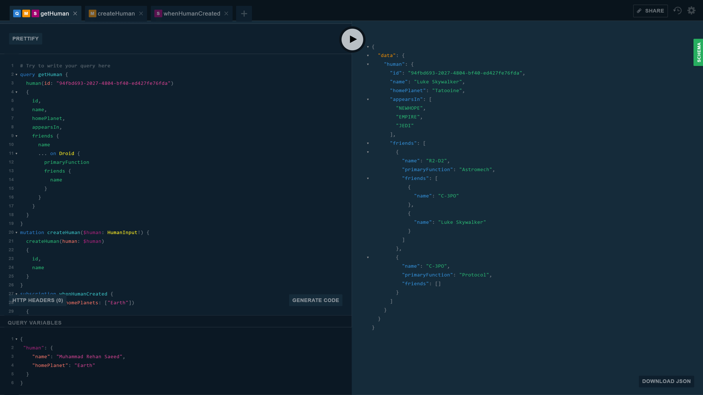

## Technology Map

The ASP.NET Core GraphQL project template contains the following features:

## Optional Feature Selection

The ASP.NET Core GraphQL project template uses `dotnet new` to enable you to turn features of the project template on or off. Find out more about `dotnet new` [here](http://rehansaeed.com/custom-project-templates-using-dotnet-new/).

#### GraphQL

- **Mutations** (Default=On) - Add [GraphQL](http://graphql.org/) mutations to change objects.
- **Subscriptions** (Default=On) - Add [GraphQL](http://graphql.org/) subscriptions to be notified when objects change.

#### Project

- **Title** - The name of the project which determines the assembly product name.
- **Description** - A description of the project which determines the assembly description.
- **Author** - The name of the author of the project which determines the assembly author and copyright information.
- **Contact** - The contact details to use if someone wants to contact you about a security vulnerability or code of conduct issues.
- **EditorConfig** - Add a .editorconfig file to set a fixed code style.
- **ReadMe** - Add a README.md markdown file describing the project.
- **TreatWarningsAsErrors** - Treat warnings as errors.
- **HttpPort** - Port number to use for the HTTP endpoint in launchSettings.json.
- **HttpsPort** - Port number to use for the HTTPS endpoint in launchSettings.json.

#### Source Control

- **SourceControl** - Select which source control provider you are using if any, to add provider specific features.
  - **GitHub** (Default) - Adds .github directory containing a code of conduct, contributing guide, pull request template and issue templates.
  - **None** - No source control provider is being used.
- **GitHubUsername** - Your GitHub username or organisation name that the project lives under.
- **GitHubProject** - The name of your GitHub project.

#### Continuous Integration (CI)

- **GitHubActions** (Default=On) - Adds GitHub Actions continuous integration and automatic release drafting.

#### Performance

- **Response Compression** (Default=On) - Enables dynamic GZIP response compression of HTTP responses. Not enabled for HTTPS to avoid the BREACH security vulnerability.

#### Security

- **HttpsEverywhere** (Default=On) - Use the HTTPS scheme and TLS security across the entire site, redirects HTTP to HTTPS and adds a Strict Transport Security (HSTS) HTTP header with preloading enabled.
- **HstsPreload** (Default=Off) - Enable Strict Transport Security (HSTS) HTTP header with preloading.
- **Authorization** (Default=On) - Enable the use of authorization policies to secure GraphQL types and fields by requiring certain claims. You need to setup authentication yourself.
- **CORS** (Default=On) - Browser security prevents a web page from making AJAX requests to another domain.
- **HostFiltering** (Default=On) - A white-list of host names allowed by the Kestrel web server e.g. example.com. You don't need this if you are using a properly configured reverse proxy.
- **SecurityTxt** - Adds a security.txt file to allow people to contact you if they find a security vulnerability.

#### Web Server

- **ForwardedHeaders** (Default=On) - If you use a load balancer, updates the request host and scheme using the X-Forwarded-Host and X-Forwarded-Proto HTTP headers.
- **ReverseProxyWebServer** - The internet facing reverse proxy web server you want to use in front of the primary web server to host the site.
  - **None** - Use Kestrel directly instead of a reverse proxy.
  - **IIS** - A flexible, secure and manageable Web server for hosting anything on the Web using Windows Server. Select this option if you are deploying your site to Azure web apps.
  - **NGINX** - A free, open-source, cross-platform high-performance HTTP server and reverse proxy.
  - **Both** (Default) - Support both reverse proxy web servers.

#### Analytics

- **HealthCheck** (Default=On) - A health-check endpoint that returns the status of this API and its dependencies, giving an indication of its health.
- **Analytics** - Monitor internal information about how your application is running, as well as external user information.
  - **Application Insights** - Monitor internal information about how your application is running, as well as external user information using the Microsoft Azure cloud.
  - **None** (Default) - Not using any analytics.
- **ApplicationInsightsKey** - Your Application Insights instrumentation key e.g. 11111111-2222-3333-4444-555555555555.

#### Cloud

- **CloudProvider** - Select which cloud provider you are using if any, to add cloud specific features.
  - **Azure** - The Microsoft Azure cloud. Adds logging features that let you see logs in the Azure portal.
  - **None** (Default) - No cloud provider is being used.

#### Tests

- **IntegrationTest** - Adds an integration test project.

#### Other

- **Docker** (Default=On) - Adds an optimised Dockerfile to add the ability build a Docker image.
- **robots.txt** (Default=On) - Adds a robots.txt file to tell search engines not to index this site.
- **humans.txt** (Default=On) - Adds a humans.txt file where you can tell the world who wrote the application. This file is a good place to thank your developers.

## Always On Features

#### GraphQL

- **Example Queries, Mutations, Subscriptions** - Provides an example schema based on the Star Wars movie.
- **Apollo Tracing** - Add instrumentation data showing how long field resolvers take to execute to the JSON response in Apollo Tracing format. [Apollo Engine](https://www.apollographql.com/engine/) can use the Apollo Tracing data to produce nice charts.
- **Automatically Return Not Acceptable** - Returns a 406 Not Acceptable if the MIME type in the Accept HTTP header is not valid.

#### Performance

- **Caching Static Files** - Static files are cached by default using the `Cache-Control` HTTP header.
- **AddMvcCore** - Uses only the features and packages from ASP.NET Core required for [GraphQL](http://graphql.org/).
- **Server Timing** - Adds the [`Server-Timing` HTTP header](https://developer.mozilla.org/en-US/docs/Web/HTTP/Headers/Server-Timing) to responses, so browser developer tools can show how long the server took to respond.

#### Security

- **Kestrel Limits** - Allow configuring Kestrel security limits such as maximum request size via configuration and set sensible stricter defaults.
- **User Secrets** - This feature is turned on when the site is in development mode to allow storing of secrets on your development machine.
- **Remove Server HTTP Header** - Removes the Server HTTP header for security and performance.

#### Logging

- **Serilog** - Has [Serilog](https://serilog.net/) built in for an excellent structured logging experience.

#### Debugging

- **Developer Exception Page** - Shows detailed exception information in the browser. Turned on in development mode only for security.

#### Patterns & Practices

- **Configure CacheProfile in JSON** - All cache profiles can be configured from a configuration file.

## How can I get it?

1. Install the latest [.NET Core SDK](https://dot.net).
2. Run `dotnet new --install Boxed.Templates` to install the project template.
3. Run `dotnet new graphql --help` to see how to select the feature of the project.
5. Run `dotnet new graphql --name "MyProject"` along with any other custom options to create a project from the template.

## Release Notes and To-Do List
You can find release notes for each version [here](https://github.com/Dotnet-Boxed/Templates/releases) and a To-Do list of new features and enhancements coming soon in the [projects](https://github.com/Dotnet-Boxed/Templates/projects) tab.

## Contributing

Please view the [Contributing](/.github/CONTRIBUTING.md) guide for more information.
