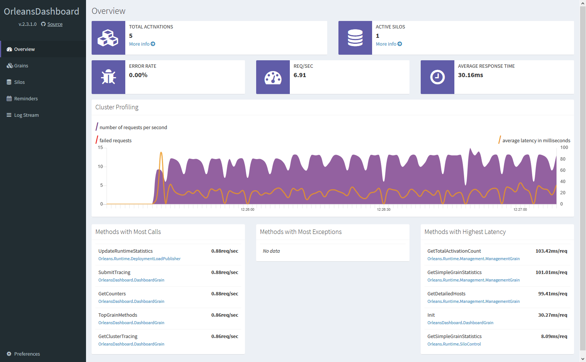

## What is Microsoft Orleans?

[Microsoft Orleans](https://dotnet.github.io/orleans/) is the database and business logic layer for your app. It's extremely fast, highly scalable and super cheap to run as you can use Azure Table Storage to store your data (which costs peanuts) all while making software development simpler using something called the [Actor model](https://en.wikipedia.org/wiki/Actor_model). You can mostly forget about having to write boilerplate code to retrieve and store data from the database, [Microsoft Orleans](https://dotnet.github.io/orleans/) takes care of that for you.

## Optional Feature Selection

The [Microsoft Orleans](https://dotnet.github.io/orleans/) project template uses `dotnet new` to enable you to turn features of the project template on or off. Find out more about `dotnet new` [here](http://rehansaeed.com/custom-project-templates-using-dotnet-new/).

#### Project

- **Title** - The name of the project which determines the assembly product name.
- **Description** - A description of the project which determines the assembly description.
- **Author** - The name of the author of the project which determines the assembly author and copyright information.
- **Contact** - The contact details to use if someone wants to contact you about a security vulnerability or code of conduct issues.
- **ReadMe** - Add a README.md markdown file describing the project.
- **EditorConfig** - Add a .editorconfig file to set a fixed code style.
- **TreatWarningsAsErrors** - Treat warnings as errors.

#### Ports

- **HttpPort** (Default=8080) - Port number to use for the HTTP endpoint in `launchSettings.json`.

#### Source Control

- **SourceControl** - Select which source control provider you are using if any, to add provider specific features.
  - **GitHub** (Default) - Adds .github directory containing a code of conduct, contributing guide, pull request template and issue templates.
  - **None** - No source control provider is being used.
- **GitHubUsername** - Your GitHub username or organisation name that the project lives under.
- **GitHubProject** - The name of your GitHub project.

#### Continuous Integration (CI)

- **GitHubActions** (Default=On) - Adds GitHub Actions continuous integration, automatic release drafting and [CodeQL](https://docs.github.com/en/free-pro-team@latest/github/finding-security-vulnerabilities-and-errors-in-your-code/about-code-scanning) security scanning.

#### Security

- **TLS** (Default=Off) - Adds TLS transport encryption to secure communication between the client and server.

#### Telemetry

- **Serilog** (Default=On) - Logging using [Serilog](https://serilog.net/) provides an excellent structured logging experience.
- **OpenTelemetry** (Default=Off) - Instrument, generate, collect, and export telemetry data (metrics, logs, and traces) using the Open Telemetry standard.

#### Analytics

- **HealthCheck** (Default=On) - A health-check endpoint that returns the status of this API and its dependencies, giving an indication of its health.
- **Analytics** - Monitor internal information about how your application is running, as well as external user information.
  - **Application Insights** - Monitor internal information about how your application is running, as well as external user information using the Microsoft Azure cloud.
  - **None** (Default) - Not using any analytics.
- **ApplicationInsightsKey** - Your Application Insights instrumentation key e.g. 11111111-2222-3333-4444-555555555555.

#### Docker

- **Docker** (Default=On) - Adds an optimised Dockerfile to add the ability build a Docker image.
- **DockerRegistry** - The Docker container registry to push Docker images to.
  - **GitHubContainerRegistry** (Default) - Push Docker images to the GitHub Container Registry.
  - **DockerHub** - Push Docker images to Docker Hub.

## Always On Features

#### Dashboard

- **Dashboard** - A dashboard showing Grain statistics.

## How can I get it?

1. Install the latest [.NET Core SDK](https://dot.net).
2. Run `dotnet new --install Boxed.Templates` to install the project template.
3. Run `dotnet new orleans --help` to see how to select the feature of the project.
5. Run `dotnet new orleans --name "MyProject"` along with any other custom options to create a project from the template.

## Release Notes and To-Do List
You can find release notes for each version [here](https://github.com/Dotnet-Boxed/Templates/releases) and a To-Do list of new features and enhancements coming soon in the [projects](https://github.com/Dotnet-Boxed/Templates/projects) tab.

## Contributing

Please view the [Contributing](/.github/CONTRIBUTING.md) guide for more information.
